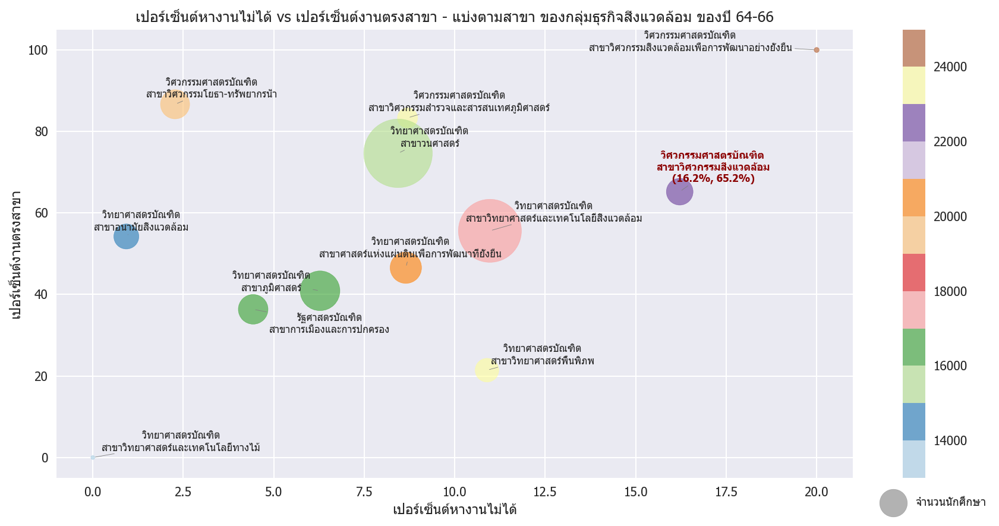

<a id="top"></a>
# DADS-5001 Mini-Project
# วิเคราะห์ข้อมูลผู้สำเร็จการศึกษาและภาวะหางานทำของบัณฑิต มหาวิทยาลัยเกษตรศาสตร์

Data Source: https://web.planning.ku.ac.th/Download/work/work_index.htm

# Content

[Part 1: Preprocessing & Cleansing](#part1)

[Part 2: Data Analysis](#part2)

[Part 3: Summary](#part3)

[Reference](#reference)

[Challenge](#challenge)

<a id="part1"></a>
# Part 1 : Preprocessing & Cleansing

## Preprocessing

ไฟล์ Excel ที่ดาวน์โหลดมา ยังไม่สามารถนำไปใช้วิเคราะห์ได้ทันที จากรูปตัวอย่าง Excel จะเห็นได้ว่ามีปัญหาหลัก ๆ 2 จุดคือ:

<table>
  <tr>
    <td align="center">
      <br>
      <em>ตัวอย่างข้อมูลใน Excel</em>
    </td>
  </tr>
</table>

1. **Column Header** มีการ *Merge*
2. **Row** ที่มีการ *Sum* ตัวเลขมาให้แล้ว (เช่นแถว Total)

### แนวทางการแก้ไข

1. กำหนดชื่อ Column ใน Excel ใหม่ เช่น:

   ```python
   [
       ('วิทยาเขต', 'D'),
       ('คณะ', 'E'),
       ('ภาค', None),
       ('สาขา', 'F'),
       ('ผู้สำเร็จการศึกษา', 'G'),
       ('ผู้บันทึกข้อมูล', 'H'),
       ('มีงานทำเดิม', 'J'),
       ('ขอบเขตสำรวจ', 'N')
   ]
   ```

2. ทำการเลือก Row ที่ต้องเก็บใน DataFrame โดยพิจารณาจาก Column “สาขา”

    ```python
    df['keep'] = np.select([df["สาขา"].isna()], [0], 1)
    df.ffill(inplace=True)
    df = df[df["keep"] == 1]
    df.drop(columns=['keep'], inplace=True)
    ```

## Cleansing
- Drop row ที่ตามกลุ่มส่วนน้อย ที่ไม่ส่งผลกระทบต่อการวิเคราะห์

  วิทยาเขตที่มีจำนวนน้อย สาเหตุมาจากข้อมูลอาจจะ Error หรือ ข้อมูลน้อยจริงๆ

  ```python
  value_to_drop = [
      'ปริญญาโท',
      '5. โครงการจัดตั้งวิทยาเขตสุพรรณบุรี',
      '5.โครงการจัดตั้งวิทยาเขตสุพรรณบุรี',
      'สถาบันสมทบ',
      '5 สุพรรณบุรี',
  ]

  df = df[~df['วิทยาเขต'].isin(value_to_drop)]
  # original 4354
  df.shape
  # (4338, 30)
  ```
- ทำ Data Standardization (การทำข้อความที่พิมพ์ไม่เหมือนกัน ให้เป็นอันเดียวกัน)

  <table style="border-collapse: collapse; width: 100%; font-family: Arial, sans-serif;">
    <thead>
      <tr>
      <th style="text-align: center;">ก่อนทำ</th>
      <th style="text-align: center;">หลังทำ</th>
      </tr>
    </thead>
  <tbody>
  <tr>
  <td>

  ```python
  df['วิทยาเขต'].unique()
  ```
  </td>
  <td>

  ```python
  df['วิทยาเขต'] = (
      df['วิทยาเขต']
      .astype(str)
      .str.replace(". ", ".", regex=False)
      .str.replace(" ", ".", regex=False)
      .apply(lambda x: re.sub(r'^[0-9]\.\s*', '', x))
      .str.replace(".", " ", regex=False)
  )
  df['วิทยาเขต'].unique()
  ```
  </td>
  </tr>
  <tr>
  <td>

  ```python
  array(['1. บางเขน', '2. กำแพงแสน', '3. ศรีราชา',
      '4. เฉลิมพระเกียรติ จังหวัดสกลนคร', '1 บางเขน', '2 กำแพงแสน',
      '3 ศรีราชา', '4 เฉลิมพระเกียรติ จังหวัดสกลนคร', '1.บางเขน',
      '2.กำแพงแสน', '3.ศรีราชา', '4.เฉลิมพระเกียรติ จังหวัดสกลนคร'],
    dtype=object)
  ```
  </td>
  <td>

  ```python
  array(['บางเขน', 'กำแพงแสน', 'ศรีราชา', 'เฉลิมพระเกียรติ จังหวัดสกลนคร'],
      dtype=object)
  ```
  </td>
  </tr>
  </tbody>
  </table>

- เติม Missing value

  ```python
  adf['ภาค'] = (
    df['ภาค']
    .str.replace(" ", "")
  )
  df['ภาค'].unique()
  # ภาค	     ปี
  # ภาคพิเศษ	432
  # ภาคปกติ    1012
  # NaN	    2894
  ```
  
  ```python
  df['ภาค'] = df['ภาค'].fillna('ภาคปกติ')
  df[['ภาค', 'ปี']].groupby('ภาค', dropna=False).count().sort_values('ปี')
  # ภาค	     ปี
  # ภาคพิเศษ	432
  # ภาคปกติ	3906
  ```

- จากการวิเคราะข้อมูลเบื้องต้น พบว่านักศึกที่ระดับสูงกว่าปริญญาตรี ไม่สามารถนำไปวิเคราะห์เรื่องอัตราการได้งานได้ เนื่องจากนักศึกษากลุ่มนี้มีงานทำอยู่แล้ว จึงทำการเลือกข้อมูลเฉพาะกลุ่มปริญญาตรีใช้ในการวิเคราะห์ข้อมูลเท่านั้น
  
<table align="center">
  <tr>
    <td align="center">
      <br>
      <em></em>
    </td>
  </tr>
</table>


<a id="part2"></a>
# Part 2 : Data Analysis

## ภาวะการได้งานของบัณฑิตไทย: จุดอ่อนที่ควรจับตาในมหาวิทยาลัยเกษตรศาสตร์

ข้อมูลภาวะการมีงานทำของบัณฑิตระดับอุดมศึกษาทั่วประเทศเผยให้เห็นภาพรวมของความพร้อมในการเข้าสู่ตลาดแรงงานของนักศึกษาไทย โดยเฉพาะเมื่อเปรียบเทียบระหว่างมหาวิทยาลัยชั้นนำ จากกราฟที่…… จะเห็นได้ว่ามหาวิทยาลัยเกษตรศาสตร์มีอัตราการได้งานของบัณฑิตที่ต่ำที่สุดในกลุ่ม ซึ่งสะท้อนถึงความท้าทายเชิงโครงสร้างในการเชื่อมโยงการศึกษาเข้ากับความต้องการของตลาดแรงงาน

ข้อมูลนี้จึงเป็นจุดตั้งต้นสำคัญในการวิเคราะห์เชิงลึก เพื่อพัฒนาแนวทางการปรับปรุงหลักสูตร การแนะแนวอาชีพ และการสร้างความร่วมมือกับภาคธุรกิจในอนาคต

<table>
  <tr>
    <td align="center">
      <br>
      <em>กราฟที่ 1 แสดงข้อมูลบัณฑิตที่มีงานทำของสถาบันการศึกษา 10 อันดับแรกของไทย</em>
    </td>
  </tr>
</table>

## การวิเคราะห์ข้อมูลภาวะการได้งานของบัณฑิต พ.ศ. 2557–2566

การศึกษาครั้งนี้มุ่งเน้นการวิเคราะห์ข้อมูลภาวะการได้งานของบัณฑิตจากมหาวิทยาลัยเกษตรศาสตร์ในช่วงระยะเวลา 10 ปี ตั้งแต่ปี พ.ศ. 2557 ถึง พ.ศ. 2566 โดยครอบคลุมทุกระดับการศึกษา ทั้งระดับปริญญาตรี โท และเอก

จากการรวบรวมข้อมูลพบว่า บัณฑิตของมหาวิทยาลัยมีการบันทึกข้อมูลภาวะการได้งานอย่างต่อเนื่องและมีความครบถ้วน โดยมีอัตราการบันทึกข้อมูลเฉลี่ยอยู่ที่ 89.26% ตลอดช่วงเวลาที่ศึกษา ซึ่งสะท้อนถึงความร่วมมือระหว่างบัณฑิตและหน่วยงานภายในมหาวิทยาลัยในการติดตามผลการจ้างงานหลังสำเร็จการศึกษา

<table>
  <tr>
    <td align="center">
      <br>
      <em>กราฟที่ 2 แสดงการบันทึกข้อมูลของบัณฑิต มหาวิทยาลัยเกษตรศาสตร์</em>
    </td>
  </tr>
</table>

---
เมื่อจำแนกสถานภาพการทำงานออกเป็น 3 กลุ่มหลักจากกราฟที่…… แสดงให้เห็นว่า **สัดส่วนของบัณฑิตที่ยังไม่ได้ทำงานสูงมาก เฉลี่ย 49.35%** โดยมีแนวโน้มใกล้เคียงกับกลุ่มที่มีงานทำ คิดเป็น**เฉลี่ย 40.38%** ซึ่งถือเป็นประเด็นที่ควรให้ความสนใจ เนื่องจากสะท้อนถึงความท้าทายในการเข้าสู่ตลาดแรงงานของบัณฑิตในช่วงเวลานั้น

<table>
  <tr>
    <td align="center">
      <br>
      <em>กราฟที่ 3 กราฟแสดงข้อมูลสถานะการทำงานของบัณฑิต  มหาวิทยาลัยเกษตรศาสตร์</em>
    </td>
  </tr>
</table>

---
จากการสำรวจกลุ่มบัณฑิตที่ยังไม่ได้เข้าสู่ตลาดแรงงาน พบว่าเหตุผลหลักที่ยังไม่ทำงานคือ **“รอผลการสมัครงาน”** คิดเป็น 32.53% รองลงมาคือ **“ไม่ประสงค์จะทำงาน”** 25.87% ซึ่งทั้งสองเหตุผลมีสัดส่วนใกล้เคียงกัน สะท้อนถึงความไม่แน่นอนในกระบวนการเข้าสู่การจ้างงาน และความหลากหลายของแรงจูงใจส่วนบุคคล

<table>
  <tr>
    <td align="center">
      <br>
      <em>กราฟที่ 4 กราฟแสดงรายละเอียดการไม่ทำงานของบัณฑิต มหาวิทยาลัยเกษตรศาสตร์</em>
    </td>
  </tr>
</table>

---
การศึกษาข้อมูลเชิงเปรียบเทียบรายคณะในช่วงปีการศึกษา 2564–2566 มุ่งเน้นการวิเคราะห์ 3 มิติหลัก ได้แก่:
- รายได้เฉลี่ยของบัณฑิตจบใหม่
พบว่า บัณฑิตที่สำเร็จการศึกษาในช่วงเวลาดังกล่าวมีรายได้เฉลี่ยอยู่ที่ 18,935 บาทต่อเดือน ซึ่งสะท้อนถึงระดับค่าตอบแทนเริ่มต้นในตลาดแรงงานสำหรับผู้จบใหม่ โดยอาจมีความแตกต่างตามสาขาวิชาและกลุ่มธุรกิจที่เกี่ยวข้อง
- สัดส่วนการทำงานตรงสาขาวิชา
จากข้อมูลพบว่า สัดส่วนของบัณฑิตที่ประกอบอาชีพตรงตามสาขาวิชาที่เรียน คือ 66.23%
- จำนวนบัณฑิตในแต่ละคณะ

การพิจารณาจำนวนผู้สำเร็จการศึกษาในแต่ละคณะช่วยให้สามารถประเมินความหนาแน่นของกำลังคนในแต่ละสาขา และวิเคราะห์ความอิ่มตัวของตลาดแรงงานในบางกลุ่มวิชา

<table>
  <tr>
    <td align="center">
      <br>
      <em>กราฟที่ 5 กราฟแสดงความสัมพันธ์ของรายได้เฉลี่ยและสัดส่วนงานตรงสาขา มหาวิทยาลัยเกษตรศาสตร์</em>
    </td>
  </tr>
</table>

---
## การจัดกลุ่มคณะตามกลุ่มธุรกิจเพื่อการวิเคราะห์ตลาดแรงงาน

เพื่อให้การวิเคราะห์สถานภาพการมีงานทำของบัณฑิตมีความชัดเจนและสามารถเปรียบเทียบข้ามสาขาได้อย่างมีระบบ จึงได้มีการจัดกลุ่มคณะและสาขาวิชาตามลักษณะของ กลุ่มธุรกิจ โดยแบ่งออกเป็นทั้งหมด 35 กลุ่มธุรกิจ อ้างอิงจากกราฟที่…… ซึ่งแสดงการเปรียบเทียบระหว่าง:
- สัดส่วนบัณฑิตที่ทำงานตรงตามสาขาวิชาที่เรียน
- สัดส่วนบัณฑิตที่หางานไม่ได้

<table>
  <tr>
    <td align="center">
      <br>
      <em>กราฟที่ 6 กราฟแสดงความสัมพันธ์ของสัดส่วนหางานไม่ได้และสัดส่วนงานตรงสาขา มหาวิทยาลัยเกษตรศาสตร์</em>
    </td>
  </tr>
</table>

---
ตามรายงาน Future of Jobs 2025 โดย World Economic Forum (WEF) ร่วมกับจุฬาลงกรณ์มหาวิทยาลัย ได้ระบุว่า:
“การเปลี่ยนแปลงด้านสิ่งแวดล้อม เช่น การลดผลกระทบจากสภาพภูมิอากาศ จะกระตุ้นความต้องการ วิศวกรสิ่งแวดล้อม และผู้เชี่ยวชาญด้านพลังงานหมุนเวียน”

จากการวิเคราะห์ข้อมูล พบว่า กลุ่มธุรกิจด้านสิ่งแวดล้อม เป็นหนึ่งในกลุ่มที่มีจำนวนผู้สำเร็จการศึกษาสูง แต่กลับมี สัดส่วนการหางานไม่ได้ในระดับสูงอย่างมีนัยสำคัญ ซึ่งสวนทางกับแนวโน้มของตลาดแรงงานโลกที่กำลังให้ความสำคัญกับความยั่งยืนและการพัฒนาเศรษฐกิจสีเขียว

เมื่อกลุ่มวิจัยได้ดำเนินการวิเคราะห์เชิงลึกในกลุ่มธุรกิจด้านสิ่งแวดล้อม โดยอ้างอิงจากกราฟที่ … พบว่า คณะวิศวกรรมศาสตร์บัณฑิต สาขาวิศวกรรมสิ่งแวดล้อม เป็นสาขาที่มี สัดส่วนบัณฑิตที่ยังไม่สามารถเข้าสู่ตลาดแรงงานได้สูงที่สุด โดยอยู่ที่ …%

<table>
  <tr>
    <td align="center">
      <br>
      <em>กราฟที่ 6 แสดง Bubble plot เปรียบเทียบสัดส่วนงานตรงสาขา, สัดส่วนบัณฑิตหางานไม่ได้ และจำนวนบัณฑิต กลุ่มธุรกิจสิ่งแวดล้อม รายคณะ ปีการศึกษา 2564-2565</em>
    </td>
  </tr>
</table>

---

<a id="part3"></a>
# Part 3 : Summary

จากข้อมูลที่ได้ visualize ดังกล่าว ….. จึงเป็นจุดตั้งต้นให้กลุ่มวิจัยสนใจประเด็นนี้เป็นพิเศษ โดยเฉพาะเมื่อพบว่า สาขาในกลุ่มธุรกิจสิ่งแวดล้อมมีการผลิตบัณฑิตในจำนวนมาก แต่กลับมีสัดส่วนการหางานไม่ได้สูง ซึ่งสะท้อนถึงความไม่สอดคล้องระหว่างการผลิตกำลังคนกับโอกาสการจ้างงานในประเทศ

เมื่อเปรียบเทียบกับอัตราการเติบโตของแต่ละประเภทอุตสาหกรรม (อ้างอิงจากรายงานผลการวิเคราะห์ข้อมูล อุปสงค์และอุปทานแรงงาน ระดับประเทศ ปี 2567) พบว่า อุตสาหกรรมที่เกี่ยวข้องกับการจัดการน้ำ บำบัดน้ำเสีย และการจัดการสิ่งปฏิกูล มีอัตราการเติบโตสูงถึง ร้อยละ 2.4 ซึ่งถือว่าเป็นอัตราที่สูงกว่าหลายอุตสาหกรรมอื่นในช่วงเวลาเดียวกัน
ข้อมูลดังกล่าวสะท้อนถึงแนวโน้มการขยายตัวของภาคอุตสาหกรรมที่เกี่ยวข้องกับสิ่งแวดล้อมและการจัดการทรัพยากรอย่างยั่งยืน ซึ่งควรจะส่งผลให้เกิดความต้องการแรงงานในสาขาที่เกี่ยวข้อง เช่น วิศวกรรมสิ่งแวดล้อม อย่างต่อเนื่อง อย่างไรก็ตาม เมื่อพิจารณาร่วมกับข้อมูลการหางานของบัณฑิตในสาขานี้ กลับพบว่ามีสัดส่วนการหางานไม่ได้ในระดับสูง จึงเป็นประเด็นที่ควรได้รับการวิเคราะห์เพิ่มเติมถึงสาเหตุของความไม่สอดคล้องระหว่างการเติบโตของอุตสาหกรรมกับการจ้างงานจริง

<table>
  <tr>
    <td align="center">
      <br>
      <em>ภาพที่ 1 อุตสาหกรรมที่มีแนวโน้มต้องการแรงงานเพิ่มขึ้น 3 อันดับแรก</em>
    </td>
  </tr>
  <tr>
    <td align="center">
      <br>
      <em>ตารางที่ 2 ประมาณการอัตราการเติบโตของอุปสงค์แรงงาน ปี 2568-2572</em>
    </td>
  </tr>
</table>

---
## การเปรียบเทียบภาวะการมีงานทำของบัณฑิตสาขาวิศวกรรมสิ่งแวดล้อมระหว่างสถาบัน

เนื่องจากข้อมูลเบื้องต้นมาจากการสำรวจของมหาวิทยาลัยเกษตรศาสตร์เพียงแห่งเดียว ทางกลุ่มวิจัยจึงได้ดำเนินการรวบรวมข้อมูลเพิ่มเติมจากมหาวิทยาลัยอื่นที่เปิดสอนใน คณะวิศวกรรมศาสตร์ สาขาวิศวกรรมสิ่งแวดล้อม ได้แก่ มหาวิทยาลัยนเรศวร และมหาวิทยาลัยเทคโนโลยีสุรนารี เพื่อใช้ในการเปรียบเทียบภาวะการมีงานทำของบัณฑิตในสาขาดังกล่าว

<table>
  <tr>
    <td align="center">
      <br>
      <em>ภาพที่ 1 อุตสาหกรรมที่มีแนวโน้มต้องการแรงงานเพิ่มขึ้น 3 อันดับแรก</em>
    </td>
  </tr>
</table>

---
จากการวิเคราะห์พบว่ามหาวิทยาลัยเกษตรศาสตร์ มีสัดส่วนบัณฑิตที่ยังไม่สามารถเข้าสู่ตลาดแรงงานได้สูงที่สุดเมื่อเทียบกับอีกสองสถาบัน อย่างไรก็ตาม เมื่อพิจารณา อัตราการหางานไม่ได้ของทั้งสามสถาบัน พบว่าอยู่ในระดับที่น่ากังวลและมีแนวโน้มคล้ายคลึงกัน
ข้อมูลนี้สะท้อนถึงความไม่สอดคล้องระหว่าง แนวโน้มของตลาดโลกที่ให้ความสำคัญกับประเด็นสิ่งแวดล้อม กับ ความสามารถในการผลิตบัณฑิตที่ตรงกับความต้องการของนายจ้างในประเทศ ซึ่งอาจเกิดจากหลายปัจจัย เช่น:
- หลักสูตรยังไม่ตอบโจทย์ทักษะเชิงปฏิบัติหรือเทคโนโลยีที่ใช้จริงในภาคอุตสาหกรรม
- ขาดการฝึกงานหรือความร่วมมือกับภาคธุรกิจในการพัฒนาทักษะเฉพาะทาง
- ความคาดหวังของนายจ้างที่เปลี่ยนไปตามเทรนด์เทคโนโลยีและความยั่งยืน

ประเด็นนี้จึงควรได้รับการพิจารณาอย่างรอบด้าน ทั้งในเชิงการปรับปรุงหลักสูตร การพัฒนาทักษะเสริม และการสร้างความร่วมมือระหว่างมหาวิทยาลัยกับภาคอุตสาหกรรม เพื่อยกระดับความสามารถในการแข่งขันของบัณฑิตในสาขาวิศวกรรมสิ่งแวดล้อมให้สอดคล้องกับทิศทางของตลาดแรงงานในอนาคต

<a id="reference"></a>
# Reference

- Wikipedia
- แนวโน้มของตลาดแรงงาน Future of Jobs: https://rta.mi.th/the-warrior-ep21-future-of-jobs/

- งานด้านสิ่งแวดล้อมทักษะที่นายจ้างมักจะ Require เช่น 
  - การทำ Report (พวก Microsoft/Gworkspace)
  - ขับรถ
  - ต้องมีใบ กว
  - ภาษาอังกฤษ
  - อ่านแบบ เขียนแบบ (Drawing เช่น Solid work, Autocad, Sketch Up)


<a id="challenge"></a>
# Challenge

- ใช้เวลาค่อนข้างมาก ในการวิเคราะห์ข้อมูลเพื่อหา Insight จาก Dataset ที่มีอยู่ ต้องนำข้อมูลที่มีอยู่มาสรุปผลเพื่อดูกราฟในหลายมิติ เพื่อให้ได้ข้อมูล Insight ออกมา
- การหาข้อมูลเพื่อนำมาเป็นข้อมูลอ้างอิงเพิ่มเติมในการวิเคราะห์ Insight หายากและเก็บข้อมูลลำบากเนื่องจากข้อมูลบางอย่างเป็น Pdf และมีความไม่ต่อเนื่องของข้อมูล
- การออกแบบการ Grouping จัดกลุ่มธุรกิจ เพื่อให้สามารถนำมาวิเคราะห์เพื่อให้เห็นภาพชัดเจนยิ่งขึ้น 